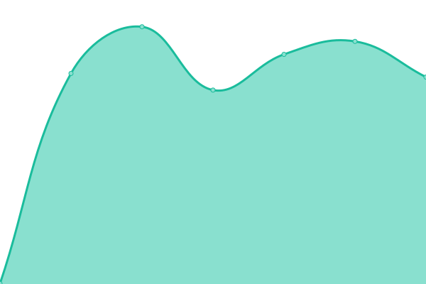
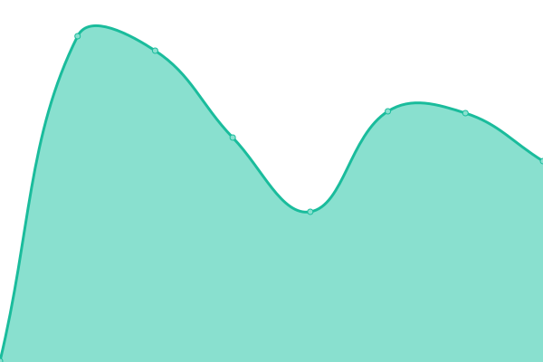
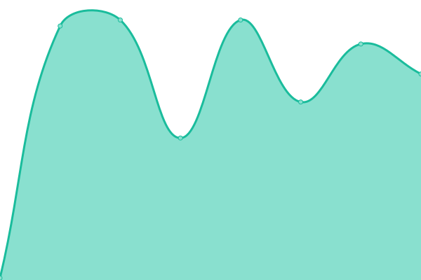
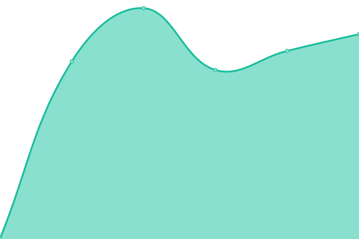
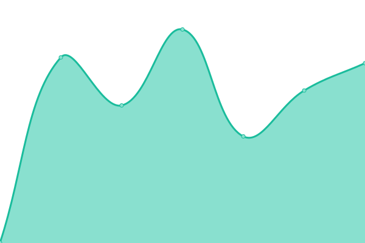
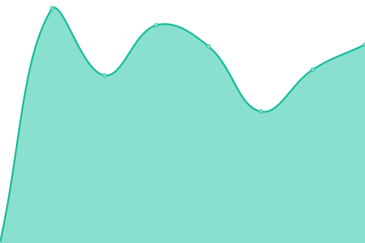
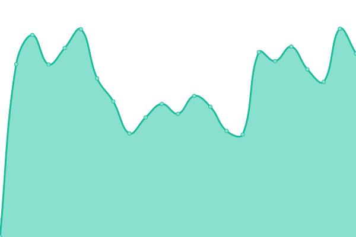
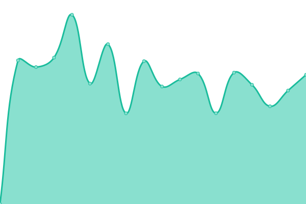

# [📈 Live Status](https://tks-it.github.io/status-page): <!--live status--> **🟧 Partial outage**

This repository contains the open-source uptime monitor and status page for [TKS](https://tks-it.github.io/status-page), powered by [Upptime](https://github.com/upptime/upptime).

With [Upptime](https://upptime.js.org), you can get your own unlimited and free uptime monitor and status page, powered entirely by a GitHub repository. We use [Issues](https://tks-it/status-page/issues) as incident reports, [Actions](https://github.com/tks-it/status-page/actions) as uptime monitors, and [Pages](https://tks-it.github.io/status-page) for the status page.

<!--start: status pages-->
<!-- This summary is generated by Upptime (https://github.com/upptime/upptime) -->
<!-- Do not edit this manually, your changes will be overwritten -->
<!-- prettier-ignore -->
| URL | Status | History | Response Time | Uptime |
| --- | ------ | ------- | ------------- | ------ |
|  [CHECKS EU](https://tkschecks.com) | 🟩 Up | [checks-eu.yml](https://github.com/TKS-IT/status-page/commits/HEAD/history/checks-eu.yml) | 

 597ms
     
 | 

<a href="https://status.grupotks.com/history/checks-eu">100.00%</a>
    

|  CHECKS EU API | 🟩 Up | [checks-eu-api.yml](https://github.com/TKS-IT/status-page/commits/HEAD/history/checks-eu-api.yml) | 

 621ms
     
 | 

<a href="https://status.grupotks.com/history/checks-eu-api">100.00%</a>
    

|  [CHECKS US](https://us.tkschecks.com) | 🟩 Up | [checks-us.yml](https://github.com/TKS-IT/status-page/commits/HEAD/history/checks-us.yml) | 

 363ms
     
 | 

<a href="https://status.grupotks.com/history/checks-us">100.00%</a>
    

|  CHECKS US API | 🟩 Up | [checks-us-api.yml](https://github.com/TKS-IT/status-page/commits/HEAD/history/checks-us-api.yml) | 

 313ms
     
 | 

<a href="https://status.grupotks.com/history/checks-us-api">100.00%</a>
    

|  [CHECKS LATAM](https://latam.tkschecks.com) | 🟩 Up | [checks-latam.yml](https://github.com/TKS-IT/status-page/commits/HEAD/history/checks-latam.yml) | 

 363ms
     
 | 

<a href="https://status.grupotks.com/history/checks-latam">100.00%</a>
    

|  CHECKS LATAM API | 🟩 Up | [checks-latam-api.yml](https://github.com/TKS-IT/status-page/commits/HEAD/history/checks-latam-api.yml) | 

 66ms
     
 | 

<a href="https://status.grupotks.com/history/checks-latam-api">100.00%</a>
    

|  [ALPHABET](https://alphabet.tkschecks.com) | 🟩 Up | [alphabet.yml](https://github.com/TKS-IT/status-page/commits/HEAD/history/alphabet.yml) | 

 607ms
     
 | 

<a href="https://status.grupotks.com/history/alphabet">100.00%</a>
    

|  ALPHABET API | 🟩 Up | [alphabet-api.yml](https://github.com/TKS-IT/status-page/commits/HEAD/history/alphabet-api.yml) | 

 529ms
     
 | 

<a href="https://status.grupotks.com/history/alphabet-api">100.00%</a>
    

|  [CrossCHECKS](https://cross.tkschecks.com) | 🟥 Down | [cross-checks.yml](https://github.com/TKS-IT/status-page/commits/HEAD/history/cross-checks.yml) | 

 0ms
     
 | 

<a href="https://status.grupotks.com/history/cross-checks">0.00%</a>
    

|  CrossCHECKS API | 🟥 Down | [cross-checks-api.yml](https://github.com/TKS-IT/status-page/commits/HEAD/history/cross-checks-api.yml) | 

 0ms
     
 | 

<a href="https://status.grupotks.com/history/cross-checks-api">0.00%</a>
    

|  [TKS Corporate Website](https://tksauditor.com) | 🟩 Up | [tks-corporate-website.yml](https://github.com/TKS-IT/status-page/commits/HEAD/history/tks-corporate-website.yml) | 

 1805ms
     
 | 

<a href="https://status.grupotks.com/history/tks-corporate-website">98.71%</a>
    

|  [TKS US Corporate Website](https://www.tkschecksusa.com) | 🟩 Up | [tks-us-corporate-website.yml](https://github.com/TKS-IT/status-page/commits/HEAD/history/tks-us-corporate-website.yml) | 

 2976ms
     
 | 

<a href="https://status.grupotks.com/history/tks-us-corporate-website">98.86%</a>
    

<!--end: status pages-->

[**Visit our status website →**](https://tks-it.github.io/status-page)

## 📄 License

- Powered by: [Upptime](https://github.com/upptime/upptime)
- Code: [MIT](./LICENSE) © [The Key to Success Innovating S.L.](https://tks-it.github.io/status-page)
- Data in the `./history` directory: [Open Database License](https://opendatacommons.org/licenses/odbl/1-0/)
